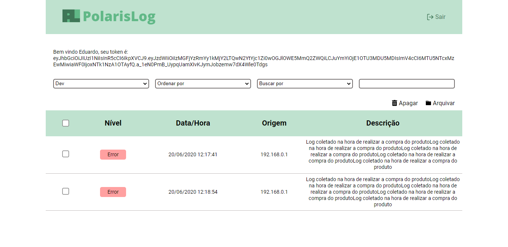

<h1 align="center">
    
</h1>
 
<p align="center">
	 

</p>

<p align="center">
  <a href="#beginner-sobre">Sobre</a>&nbsp;&nbsp;&nbsp;|&nbsp;&nbsp;&nbsp;
  <a href="#fire-como-contribuir">Como contribuir</a>&nbsp;&nbsp;&nbsp;|&nbsp;&nbsp;&nbsp;
  <a href="#lock-licença">Licença</a>
</p>

<p align="center">
  
</p>

Projeto desenvolvido durante o **AcelerateDev** realido pela [Codenation](https://www.codenation.dev/) em parceira com a [Stone](https://www.stone.com.br/).

##  :beginner: Sobre
Em projetos modernos é cada vez mais comum o uso de arquiteturas baseadas em serviços ou microsserviços. Nestes ambientes complexos, erros podem surgir em diferentes camadas da aplicação (backend, frontend, mobile, desktop) e mesmo em serviços distintos. Desta forma, é muito importante que os desenvolvedores possam centralizar todos os registros de erros em um local, de onde podem monitorar e tomar decisões mais acertadas. Neste projeto vamos implementar um sistema para centralizar registros de erros de aplicações.


## :zap: Como rodar
Para rodar o projeto é necessário renomear o arquivo .env.example para .env dentro da pasta backend

### :notebook: Requisitos
Lista de requisitos necessários para rodar o projeto
- [Docker](https://www.docker.com/)
- [Docker Compose](https://docs.docker.com/compose/)

###  :electric_plug: Instalação
- [Guia de instalação do Docker (macOs, Windows, Linux)](https://docs.docker.com/get-docker/)
- [Guia de instalação do Docker Compose (macOs, Windows, Linux)](https://docs.docker.com/compose/install/)

###  :package: Comandos

- Para executar o projeto é necessário executar o seguinte comando na pasta raiz do projeto
```
docker-compose up -d
```

##  :wrench: Desenvolvimento
Instruções para desenvolver o projeto

### :notebook: Requisitos
Lista de todos os requisitos necessários para desenvolver esse projeto.
- [.NET Core SDK 3.1](https://dotnet.microsoft.com/download/dotnet-core/3.1)
- [PostgreSQL](https://www.postgresql.org/)
- [Node.js](https://nodejs.org/)

###  :nut_and_bolt: Ambiente de Desenvolvimento
Configurações necessário para o ambiente de desenvolvimento
- Preencher o arquivo appsettings.json
- Executar o comando npm install na pasta "frontend"

###  :hammer: Build
#### Backend
```
dotnet build
```

### :rocket: Publicar
#### Backend
```
dotnet publish -c Release
```

#### Frontend
```
dotnet build
```

 ##  :fire: Como contribuir
 
Contribuições são sempre bem-vindas e podem ser feitas de diferentes formas.
 1. **Reportar um bug** <br>
Se você encontrar algum bug, ele poderá ser reportado através de issues [aqui](https://github.com/CarlosEduard0/PolarisLog/issues).

 2. **Solicitar uma nova funcionalidade** <br>
 Você pode solicitar uma nova funcionalidade através de issues [aqui](https://github.com/CarlosEduard0/PolarisLog/issues) e  caso queria, poderá implementá-la seguindo os passos:
-   Faça um fork desse repositório;
-   Cria uma branch com a sua feature:  `git checkout -b feature/minha-feature`;
-   Faça commit das suas alterações:  `git commit -m 'feat: Minha nova feature'`;
-   Faça push para a sua branch:  `git push origin feature/minha-feature`.


##  :lock: Licença

Esse projeto está sob a licença MIT.
